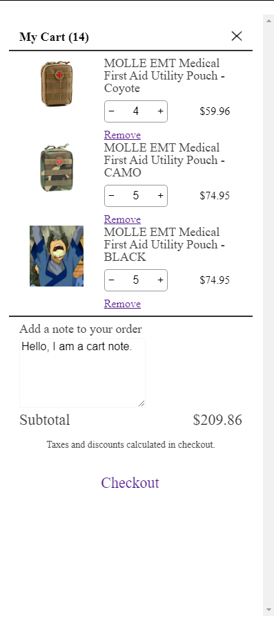

## Installation
### External Dependencies
  None
### Internal Dependencies
  [12 Column Grid CSS](https://gitlab.com/ambaum/internal/shopify-starter-theme/-/blob/master/theme/src/assets/grid-12-col.css)
### Manual

1. Paste the contents of the [12 Column Grid CSS](https://gitlab.com/ambaum/internal/shopify-starter-theme/-/blob/master/theme/src/assets/grid-12-col.css) dependency to the main stylesheet.

2. Paste the contents of `cartdrawer.scss` to the main stylesheet.

3. Paste `cartdrawer.js` to main script, replace `export default` with `theme.CartDrawer = `. *Until this respository is updated, if you are not using Shopify you will have to modify all the `fetch` requests within `cartdrawer.js` and their resulting data to their relevant counterparts according to your platform.

4. Paste the contents of `cartdrawer.liquid` into a section and include that section at the end of the main body tag. *Until this respository is updated, if you are not using Shopify you will have to replace all the items within the double curly braces `{{ item }}` with their relevant counterparts according to your platform.

5. Initialize the cart drawer.
```js
document.addEventListener("DOMContentLoaded", (event) => {
  let cartDrawer = new theme.CartDrawer();
  cartDrawer.init();
});
```
### npm

1. Install common frontend
  ```sh
  npm install @ambaum/common-frontend
  ```

2. Import feature
  ```sh
  import { CartDrawer } from '@ambaum/common-frontend'
  ```

## Usage

To open the cart drawer, simply add the data attribute `cart-open` to an element, like so.

```html
  <button data-cart-open>
    <h1>CART DRAWER</h1>
  </button>
```

To add an item to the cart drawer, add the data parameter `cart-add` to an element with the product id of the item you would like to add, like so.

```html
  <button data-cart-add='XXXXXXXXXXXXXXXXXXXXXXXXXX'>
    <h1>ADD TO CART</h1>
  </button>
```

This will add an item to cart then open the cart drawer with the new data.

You may also add the parameter `data-cart-add-qty`,  it is an optional parameter which denotes the quantity of item you would like to add, it defaults at 1.

```html
  <button data-cart-add='XXXXXXXXXXXXXXXXXXXXXXXXXX' data-cart-add-qty='5'>
    <h1>ADD 5 TO CART</h1>
  </button>
```

To remotely trigger intercept a process and instead use the cart drawer, there is also a `cartDrawer:add` event to hook onto.

```js
  let cartDrawerAdd = new CustomEvent('cartDrawer:add', {detail:{id:'XXXXXXXXXX', qty:1}});
  document.dispatchEvent(cartDrawerAdd);
```