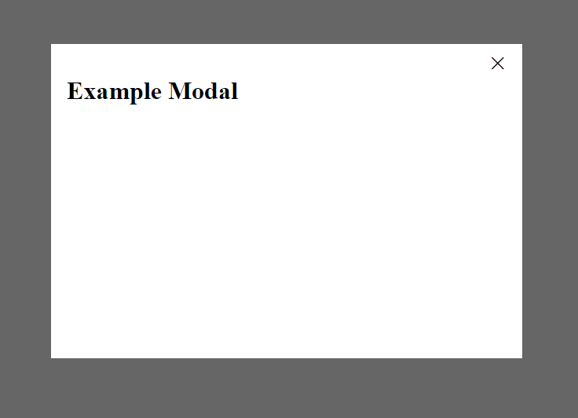

## Installation
### External Dependencies
  [jQuery](https://code.jquery.com/)
### Internal Dependencies
  None
### Manual

1. Add the modal overlay to end of body tag.
  ```html
  <div class="ambaum-modal__overlay ambaum-modal__closed"></div>
  ```
2. Put the modal html to end of body tag. Note the data attribute `data-modal="example-modal"`, this is the modal's reference.
  ```html
  <div class="ambaum-modal ambaum-modal__closed" data-modal="example-modal">
    <div class="ambaum-modal__inner">
      <div class="ambaum-modal__close"><span>&times;</span></div>
      <div>
        <h1>Example Modal</h1>
      </div>
    </div>
  </div>
  ```
3. Paste `modals.scss` to main stylesheet.

4. Paste `modals.js` to main script, replace `export default` with `theme.Modals = `.

5. Add a trigger to your modal. Note the data attribute `data-trigger-modal="example-modal"`, this must be the same as the reference used above.
```html
  <button data-trigger-modal="example-modal">Click Me</button>
```
6. Instansiate modal class
```js
  $(document).ready(function(){
    const modals = new theme.Modals();
    modals.init();
  });
```
### npm

1. Install common frontend
  ```sh
  npm install @ambaum/common-frontend
  ```

2. Import feature
  ```sh
  import { Modals } from '@ambaum/common-frontend'
  ```

<!-- USAGE EXAMPLES -->
## Usage

```html

  <button data-trigger-modal="example-modal">Click Me</button>
  <button data-trigger-modal="example-modal-2">Click Me More</button>
  <button data-trigger-modal="example-modal-3">Click Me Even More</button>

  <div class="ambaum-modal__overlay ambaum-modal__closed"></div>

  <div class="ambaum-modal ambaum-modal__closed" data-modal="example-modal">
    <div class="ambaum-modal__inner">
      <div class="ambaum-modal__close"><span>&times;</span></div>
      <div>
        <h1>Example Modal</h1>
      </div>
    </div>
  </div>

  <div class="ambaum-modal ambaum-modal__closed" data-modal="example-modal-2">
    <div class="ambaum-modal__inner">
      <div class="ambaum-modal__close"><span>&times;</span></div>
      <div>
        <h1>Example Modal 2</h1>
      </div>
    </div>
  </div>

  <div class="ambaum-modal ambaum-modal__closed" data-modal="example-modal-3" data-modal-background-image="image_src">
    <div class="ambaum-modal__inner">
      <div class="ambaum-modal__close"><span>&times;</span></div>
      <div>
        <h1>Example Modal 3 with background image</h1>
      </div>
    </div>
  </div>
```
