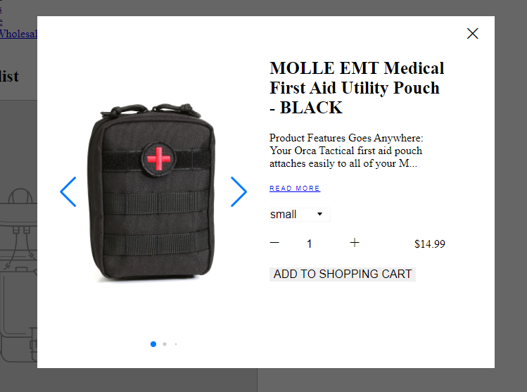

## Installation
### External Dependencies
  [jQuery](https://code.jquery.com/)
  [Swiperjs](https://swiperjs.com)
### Internal Dependencies
  [Modals](https://gitlab.com/ambaum/internal/common-frontend/-/tree/feature/ambaum-quickview/src/frontend-components/Modals)


### Manual

1. Install the internal [Modals](https://gitlab.com/ambaum/internal/common-frontend/-/tree/feature/ambaum-quickview/src/frontend-components/Modals) dependancy.

2. Add SwiperJS CDNs to main `head` tag.
```html
  <link rel="stylesheet" href="https://unpkg.com/swiper/swiper-bundle.css" />
  <link rel="stylesheet" href="https://unpkg.com/swiper/swiper-bundle.min.css" />

  <script src="https://unpkg.com/swiper/swiper-bundle.js"></script>
  <script src="https://unpkg.com/swiper/swiper-bundle.min.js"></script>
```

3. Paste the contents of `quickview.html` to the end of the main body tag.
4. Paste the contents of `quickview.scss` to the end of the main style sheet.
5. Paste the contents of  `quickview.js` to the end of the main script, replace `export default` with `theme.Quickview = `.

6. Place this trigger code where you would like to trigger the quickview component. Note the `data-product` attribute, this must be the handle of the product or another unique identifier used in the platform's product API.
```html
<div class="amb_quickview-item__cta-buttons" data-product='PRODUCT-HANDLE'>
  <div class="amb_quickview-item__cta-button btn hero__btn" data-amb-quickview-modal="true" data-trigger-modal="amb-quickview-modal">Quickview</div>
  <div class="amb_quickview-item__cta-button btn hero__btn" data-amb-quickview-atc="true">Add To Cart</div>
</div>
```

7. Retrieve the Request class for the platform you would like the quickview component to be used on. These can be found in the utilities folder of this repository. The [Shopify Request Class](https://gitlab.com/ambaum/internal/common-frontend/-/blob/master/src/utilities/ShopifyRequest.js) will be used as an example in this documentation.

8. Paste the contents of the request class to the end of the main script tag. Remove `export default `.

9. Initialize the quickview component with the modals component.
```js

$(document).ready(function() {
  let modals = new theme.Modals;
  let quickviewProducts = new theme.Quickview(new ShopifyRequest(), modals);
  modals.init();
  quickviewProducts.init();
});
```

### npm

1. Install common frontend
  ```sh
  npm install @ambaum/common-frontend
  ```

2. Import feature
  ```sh
  import { Quickview } from '@ambaum/common-frontend'
  ```

<!-- USAGE EXAMPLES -->
## Usage


The quickview component expects a PlatformRequest of the form:
```js
export default class PlatformRequest {
  async getProductData(handle) {
    // api call to platform getting product data.
    // expects object as return result.
  }
  async addItemToCart(id, qty) {
    // api call to platform adding product to cart
    // expects promise as return result
  }
}
```

The product data gathered from `getProductData` should be of the form(Shopify's default form):

```
{
  available: true,
  id: 1876061323375,
  price: 1499, // price of product in cents
  title: "Super cool product title",
  description: "<h2><span>Super Cool Product Descriptions</span></h2>", // html will be stripped
  handle: "your-cool-product-handle",
  url: "/link/to/your/product"
  images: ['cdn://to/image/1', 'cdn://to/image/2', 'cdn://to/image/3'],
  variants: [{
              available: true,
              featured_image: 'cdn://to/variant/image',
              id: 11223344556677,
              title: 'My cool variant'
              },//must be at least one variant as default
              ...
            ]
}
```


